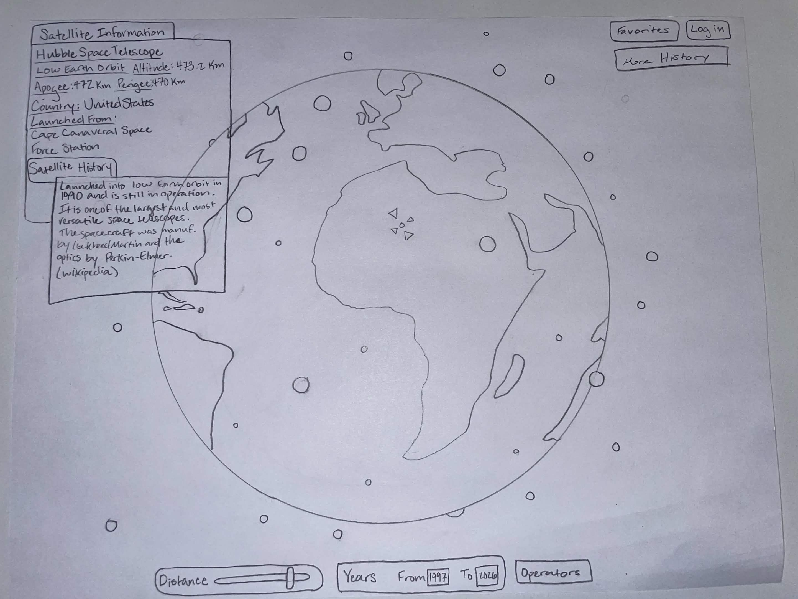

# Space Junk Tracker

**Team:** Josh Loftus, Boston Cox, Yichang Zou, August Steffen

---

## 1. Project Title

Space Junk Tracker

## 2. Project Summary

There are over 33,000 tracked objects in Earth's orbit split between active satellites, dead ones, spent rocket bodies, and debris, and this number is only growing. We are building an app that pulls the public satellite data catalog and launch records into a database. The users are able to query the orbital population as a whole population, and can search, filter, compare, and save objects to their own watchlists with notes.

Other applications like [Orbital Radar](https://orbitalradar.com/) are focused on live tracking of objects, but our application will focus on the history of the objects in space. For example, the user can see how the orbital population changes over time and can filter based on country, company, type of satellite, etc.

## 3. Creative Component

The creative component will be an interactive visual of the Earth with the orbital objects flying around it. There will be a slider below it (or to the side) where the user can control the year, ranging from approximately 1960 to today. As the slider is moved, satellites and other orbital objects will appear and disappear based on the year selected by the slider.

There will also be another slider to control how far away the satellites and debris are from the surface of the Earth. There could also be options to impose filters on the visualization where, for example, only satellites and debris launched by the U.S. would be displayed.

Another potential creative component could be a small rocket ship that flies around the screen and follows the user's mouse.

## 4. Usefulness

Our application is useful because it will educate our users about satellites and debris from rockets and shuttles. Users will be able to view information about different satellites and launches to learn more about them, including when, where, and why they were launched.

There is a similar website called orbitalradar.com that displays satellites orbiting the globe. What sets our website apart from theirs is focus: Orbital Radar is more focused on the live tracking of these objects, while ours is focused more on the history of each object.

Users are also able to make an account so that they can favorite satellites that they like or find interesting, as well as leave a review of the satellite. This would also allow us to display a list of popular satellites as well as best-rated satellites.

## 5. Realness

We use several real datasets about satellites.

### CelesTrak Satellite Catalog (SATCAT)

A public satellite catalog maintained by CelesTrak, available as a CSV file. The dataset currently contains approximately 70,000 objects and has 17 attributes, including:

- Object name
- `NORAD_CAT_ID`
- Object type (including satellites and debris)
- Operation status
- Owners
- Launch dates and sites
- Decay date (if applicable)
- Periods and altitudes

It has both basic information about space objects and descriptive information. For example, `NORAD_CAT_ID` can be used to join SATCAT with other external datasets containing more detailed information, and launch dates and sites can be used to trace the major milestones in a satellite's lifecycle.

### General Catalog of Artificial Space Objects (GCAT)

Maintained by Jonathan McDowell, available at <https://planet4589.org/space/gcat>.

We mainly use the Event Catalog and the Launch Catalog. As our project's focus is on the history of satellites, both provide useful information. The Event Catalog records different phases in a satellite's lifecycle. The Launch Catalog provides additional information about launches. This makes GCAT a good dataset for presenting the history of a satellite.

## 6. Functionality

### Create

- A signed-in user creates a **watchlist** by submitting a form with a name and optional description, when they want to start tracking a group of objects.
- A signed-in user creates a **watchlist entry** by clicking "add" on a satellite's detail page, optionally attaching a note, when they want to save that object.
- A visitor creates a **user account** by submitting a form with email and password, when they want to save anything.

### Read

- Any visitor reads **satellite records** (name, type, operator, country, status, orbit, launch and decay dates) by browsing the directory or opening an object's detail page.
- Any visitor reads **launch records** (provider, rocket, pad, date) from a launch's page or from a linked satellite.
- Any visitor reads **grouped views** such as objects grouped by operator, country, orbital band, or decade, from the comparison and statistics pages.
- A signed-in user reads **their own watchlists** and notes from their account page.

### Update

- A signed-in user updates a **note** on a saved object by editing it from their watchlist page, when their thinking about that object changes.
- A signed-in user updates a **watchlist's name or description** from the same page.

### Delete

- A signed-in user deletes a **watchlist entry** by removing an object from a list they no longer want to follow.
- A signed-in user deletes an **entire watchlist** from their account page.

### Search

- Any visitor searches **objects by keyword**, matching on name, operator, country, or designator, by typing into the search bar. Results display as a list linking to detail pages.
- Any visitor filters results by **object type, status, orbital band, or launch date range**, when narrowing a broad search.

### Low-Fidelity UI Mockup

## 7. Work Distribution

| Member | Responsibilities |
| --- | --- |
| **Yichang Zou** | Data collection (CelesTrak SATCAT, GCAT), data cleaning and source reconciliation, backend: database implementation and loading, report |
| **Josh Loftus** | Backend: schema design and normalization, ER diagram, advanced queries and indexing analysis, report |
| **August Steffen** | UI/UX design and mockup, frontend: search, browse, and detail pages, backend: CRUD and watchlist features, report |
| **Boston Cox** | Frontend: data visualization, backend: advanced database features (stored procedure, trigger, transaction), repository and release management, report |
