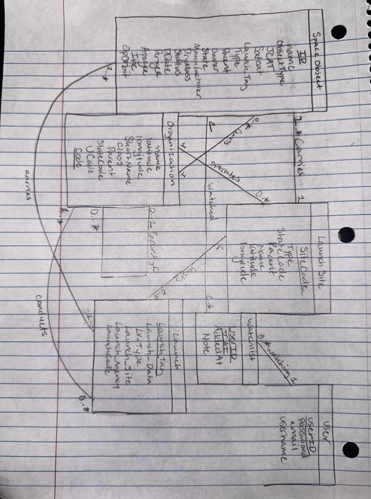

# Stage 2: Conceptual and Logical Database Design

## UML Diagram

## Entities

SpaceObject: The main entity. Each record is one tracked object in orbit (satellite, rocket body, debris fragment, etc.). Its attributes, such as orbit, size, and status, describe only that object.

Launch: A separate entity rather than an attribute of SpaceObject. Many objects can be deployed in a single launch, so storing launch details (date, vehicle, outcome) on each object would duplicate them across every object.

LaunchSite: A separate entity rather than an attribute of Launch. Many launches occur at the same site, so site details (name, location, country) are stored once instead of being repeated for every launch.

Organization: A separate entity rather than an attribute. Agencies and companies have their own descriptive data (name, class, location, country) and are associated with many objects, launches, and launch sites, so storing them once avoids redundancy. Countries are also stored as Organization rows, which is why StateCode points back into Organization.

User: A separate entity that holds the user's information (username, email, password). This is separate from any of the entities listed above.

WatchList: A separate entity rather than an attribute of User. Each row is one watchlist entry: one user watching one SpaceObject, with the date added and a note. A user can have many entries, so this data (note, object, addedAt) is stored separately from the User and from the SpaceObject.

## Relationships and Cardinality

Launch – SpaceObject, "carries" (1-to-many): One launch carries one or more objects (1..\*), and we assume each object is deployed by exactly one launch.

LaunchSite – Launch, "hosts" (1-to-many): One launch site hosts many launches, but each launch takes place at exactly one site.

Organization – SpaceObject, "owns" (1-to-many): An organization owns/operates many objects, and we assume each object has a single owner/operator.

Organization – Launch, "conducts" (1-to-many): An organization conducts many launches, and each launch is run by a single organization (Launch_Agency).

Organization – LaunchSite, "operates" (1-to-many): An organization operates many launch sites, and each site has a single operating organization.

Organization – Organization, "parent of" (1-to-many, optional): An organization can be the parent of many organizations (for example, an agency and its centers), and each organization has at most one parent (0..1).

User – WatchList, "watching" (1-to-many): A user can have many watchlist entries, and each entry is held by one user.

SpaceObject – WatchList, "watched" (1-to-many): Each watchlist entry watches exactly one SpaceObject, while one object can appear in many entries across users.

User – SpaceObject (many-to-many, through WatchList): Because each WatchList row links one user to one object, a user can watch many objects and an object can be watched by many users. WatchList is the associative entity that resolves this many-to-many relationship, and its key is (UserID, JCAT).

LaunchSite – SpaceObject, "carries" (derived): The diagram shows a launch site carrying many objects (1..\* objects to 1 site). We treat this as derived through Launch (object, then launch, then site), so it is not stored as a separate foreign key. Storing it would repeat what Launch.Launch_Site already says.

## Relational Schema

SpaceObject(ID:INT [PK], Name:VARCHAR(30), JCAT:VARCHAR(12) [UNIQUE], Satcat:VARCHAR(8), Launch_Tag:VARCHAR(12) [FK to Launch.Launch_Tag], Type:VARCHAR(12), Parent:VARCHAR(12) [FK to SpaceObject.JCAT], Owner:VARCHAR(8) [FK to Organization.Code], Manufacturer:VARCHAR(8) [FK to Organization.Code], DryMass:DECIMAL(10,1), Status:VARCHAR(8), DDate:DATETIME, Perigee:INT, Apogee:INT, Inc:DECIMAL(5,2), OpOrbit:VARCHAR(8))

Organization(Code:VARCHAR(8) [PK], UCode:VARCHAR(8), Name:VARCHAR(80), ShortName:VARCHAR(20), Class:CHAR(1), Parent:VARCHAR(8) [FK to Organization.Code], StateCode:VARCHAR(8) [FK to Organization.Code], Latitude:DECIMAL(9,4), Longitude:DECIMAL(9,4))

LaunchSite(SiteCode:VARCHAR(8) [PK], Type:CHAR(2), Name:VARCHAR(80), StateCode:VARCHAR(8) [FK to Organization.Code], Parent:VARCHAR(8) [FK to Organization.Code], Latitude:DECIMAL(9,4), Longitude:DECIMAL(9,4))

Launch(Launch_Tag:VARCHAR(12) [PK], Launch_Date:DATETIME, LV_Type:VARCHAR(30), Launch_Site:VARCHAR(8) [FK to LaunchSite.SiteCode], Launch_Agency:VARCHAR(8) [FK to Organization.Code], LaunchCode:VARCHAR(4))

User(UserID:INT [PK], Username:VARCHAR(30), Email:VARCHAR(100), Password:VARCHAR(255))

Watchlist(UserID:INT [PK] [FK to User.UserID], JCAT:VARCHAR(12) [PK] [FK to SpaceObject.JCAT], AddedAt:DATETIME, Note:VARCHAR(255))

JCAT is unique in GCAT, so it is a candidate key of SpaceObject. ID is the primary key, and the foreign keys SpaceObject.Parent and Watchlist.JCAT reference the unique JCAT column.

## Normalization (BCNF)

Our database is already in BCNF because the left side of every non-trivial functional dependency is a superkey.

SpaceObject: ID -> every other attribute. JCAT -> every other attribute (JCAT is a candidate key). No other attribute determines anything else.

Organization: Code -> every other attribute. (UCode only groups the periods of one organization and determines nothing else.)

LaunchSite: SiteCode -> every other attribute.

Launch: Launch_Tag -> every other attribute.

User: UserID -> every other attribute. Username -> UserID and Email -> UserID (both are candidate keys).

Watchlist: (UserID, JCAT) -> AddedAt, Note. Both attributes describe the pair, so there is no partial dependency.

Since every determinant is a superkey in every table, the schema is in BCNF, which also means it is in 3NF.
